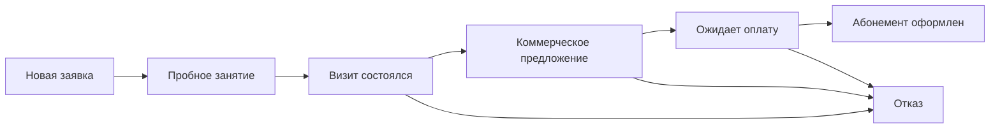
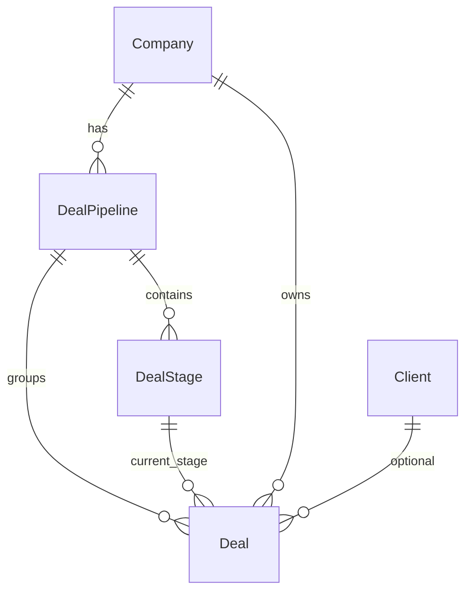

# Урок 21 — Канбан продаж для фитнес-клуба: воронки, этапы и база данных

## Зачем этот урок

В первой версии канбан был **захардкожен** во frontend: пять колонок с фиксированными id (`new`, `preparation`…). Это удобно для демо, но **не продукт**:

- у разных клубов разные этапы продаж;
- нельзя добавить вторую воронку (корпоративные продажи, продление абонементов);
- цвета и названия нельзя менять без деплоя frontend.

В этом уроке разберём, как мы превратили демо в **рабочую систему**: воронки и этапы в PostgreSQL, REST API, динамический канбан.

> **Для кого:** разработчик, который уже прошёл [Урок 13](./13-how-to-develop-full-feature.md) и хочет увидеть **сложную фичу целиком** — с миграцией данных и связями между моделями.

---

## Что получилось в итоге

| Слой | Файлы |
|------|-------|
| Модели | `backend/crm/models.py` → `DealPipeline`, `DealStage`, обновлённый `Deal` |
| Сервис дефолтов | `backend/crm/pipelines.py` |
| Миграция + перенос данных | `backend/crm/migrations/0003_deal_pipelines.py` |
| API воронок | `backend/crm/pipeline_serializers.py`, `pipeline_views.py` |
| API сделок | `backend/crm/deal_serializers.py`, `deal_views.py` |
| URL | `backend/crm/urls.py` |
| Тесты | `backend/crm/tests/test_deal_api.py` |
| Seed | `backend/core/management/commands/seed_demo.py` |
| Типы TS | `frontend/lib/types.ts` |
| API-клиент | `frontend/lib/api.ts` → `getPipelines()`, `getDeals()` |
| Actions | `frontend/app/actions/deals.ts` |
| Канбан | `frontend/components/crm-kanban-board.tsx` |
| Селектор воронки | `frontend/components/crm-funnel-select.tsx` |
| Страница CRM | `frontend/app/dashboard/page.tsx` |
| Настройки | `frontend/app/dashboard/settings?section=pipelines` |

---

## Бизнес-логика фитнес-клуба

Типичная воронка **продажи абонемента** выглядит так:



| Этап | Код в БД | Зачем клубу |
|------|----------|-------------|
| Новая заявка | `new_lead` | Заявка с сайта, звонок, мессенджер |
| Пробное занятие | `trial` | Записали на пробную тренировку |
| Визит состоялся | `trial_done` | Человек пришёл — можно продавать |
| Коммерческое предложение | `offer` | Менеджер предложил тариф |
| Ожидает оплату | `payment` | Счёт выставлен, ждём оплату |
| Абонемент оформлен | `won` | Успешная сделка (`is_won`) |
| Отказ | `lost` | Проигрыш (`is_lost`) |

Эти этапы **не зашиты в код навсегда** — они создаются в таблице `crm_dealstage` и настраиваются через API или admin.

---

## Архитектура данных

Три связанные сущности:



**Правило целостности:** у сделки `deal.stage` всегда принадлежит той же воронке, что и `deal.pipeline`. Проверка — в `Deal.clean()` и в `DealWriteSerializer.validate()`.

---

## Шаг 1. Модели Django

### DealPipeline — воронка

Одна компания может иметь несколько воронок:

- «Продажи абонементов» (по умолчанию)
- «Корпоративные продажи»
- «Продление»

Поля: `name`, `slug`, `is_default`, `is_active`, `sort_order`.

### DealStage — колонка канбана

Принадлежит одной воронке. Поля: `name`, `code`, `color` (hex), `sort_order`, `is_won`, `is_lost`.

### Deal — сделка

**Было:** `stage = CharField(choices=Stage.choices)` — enum в коде.

**Стало:**

```python
pipeline = models.ForeignKey("DealPipeline", ...)
stage = models.ForeignKey("DealStage", on_delete=models.PROTECT, ...)
```

`PROTECT` на этапе — нельзя удалить колонку, пока в ней есть сделки.

---

## Шаг 2. Сервис дефолтной воронки

Файл `backend/crm/pipelines.py`:

```python
def ensure_default_pipeline(company: Company) -> DealPipeline:
    pipeline, created = DealPipeline.objects.get_or_create(
        company=company,
        slug="membership-sales",
        defaults={"name": "Продажи абонементов", "is_default": True, ...},
    )
    if created or not pipeline.stages.exists():
        for stage_data in DEFAULT_FITNESS_STAGES:
            DealStage.objects.update_or_create(
                pipeline=pipeline, code=stage_data["code"], defaults=stage_data,
            )
    return pipeline
```

**Когда вызывается:**

- при первом `GET /api/v1/pipelines/` для компании без воронок;
- в `seed_demo` перед созданием демо-сделок.

Так новый клуб **сразу получает рабочий канбан**, без ручной настройки.

---

## Шаг 3. Миграция с переносом старых данных

Нельзя просто удалить поле `stage` (CharField) — в базе уже были сделки.

Порядок в `0003_deal_pipelines.py`:

1. Создать `DealPipeline` и `DealStage`.
2. Переименовать старое поле: `stage` → `stage_legacy`.
3. Добавить FK `pipeline` и `stage` (nullable).
4. **RunPython** — для каждой компании создать воронку и проставить сделкам новые этапы по карте:

   | Старый код | Новый код |
   |------------|-----------|
   | `new` | `new_lead` |
   | `preparation` | `trial` |
   | `in_progress` | `offer` |
   | `prepayment` | `payment` |
   | `final_invoice` | `payment` |

5. Удалить `stage_legacy`.
6. Сделать FK обязательными.

> **Урок:** при смене типа поля всегда планируйте **data migration**, а не только `AlterField`.

---

## Шаг 4. API воронок

### Список воронок с этапами

```http
GET /api/v1/pipelines/?company=sportmax
Authorization: Token <token>
```

Ответ (сокращённо):

```json
[
  {
    "id": 1,
    "name": "Продажи абонементов",
    "slug": "membership-sales",
    "is_default": true,
    "stages": [
      {
        "id": 1,
        "name": "Новая заявка",
        "code": "new_lead",
        "color": "#3d5f8f",
        "sort_order": 10,
        "is_won": false,
        "is_lost": false,
        "deals_count": 2
      }
    ]
  }
]
```

### CRUD

| Метод | URL | Действие |
|-------|-----|----------|
| POST | `/api/v1/pipelines/` | Создать воронку |
| PATCH | `/api/v1/pipelines/<id>/` | Переименовать, сделать default |
| DELETE | `/api/v1/pipelines/<id>/` | Мягкое отключение (`is_active=false`) |
| POST | `/api/v1/pipelines/<id>/stages/` | Добавить этап |
| PATCH | `/api/v1/pipelines/<id>/stages/<stage_id>/` | Цвет, порядок, название |
| DELETE | `/api/v1/pipelines/<id>/stages/<stage_id>/` | Только если нет сделок |

Полная справка: [`docs/api/deals-and-pipelines.md`](../api/deals-and-pipelines.md).

---

## Шаг 5. API сделок (обновление)

### Список по воронке

```http
GET /api/v1/deals/?company=sportmax&pipeline=1
```

### Перемещение на канбане

```http
PATCH /api/v1/deals/5/?company=sportmax
Content-Type: application/json

{"stage_id": 3}
```

### Быстрая сделка

```http
POST /api/v1/deals/?company=sportmax

{
  "title": "Быстрая сделка",
  "amount": "0",
  "pipeline_id": 1,
  "stage_id": 1
}
```

В ответе сделки теперь приходят с `stage_id`, `stage_label`, `stage_color` — frontend рисует колонки **без своего справочника**.

---

## Шаг 6. Тесты

`backend/crm/tests/test_deal_api.py`:

- `test_deal_create_and_list` — создание с `stage_id`
- `test_deal_stage_update` — PATCH меняет этап
- `test_pipeline_list_creates_default_fitness_pipeline` — GET pipelines создаёт 7 этапов
- `test_pipeline_create_and_stage_create` — новая воронка + этап

Запуск:

```bash
cd backend
../.venv/bin/python manage.py test crm.tests.test_deal_api --settings=config.settings.dev
```

---

## Шаг 7. Frontend — от хардкода к API

### Было (`frontend/lib/crm-kanban.ts`)

```typescript
export const dealKanbanStages = [
  { id: "new", label: "Новая", headerClass: "...", accent: "#3d5f8f" },
  // ...
];
```

### Стало

Колонки берутся из `pipeline.stages`:

```typescript
const stages = [...pipeline.stages].sort((a, b) => a.sort_order - b.sort_order);
```

Заголовок колонки:

```tsx
<header className="crm-kanban-col-header" style={{ background: stage.color }}>
```

Drag-and-drop вызывает:

```typescript
await updateDealStageAction(dealId, stageId); // числовой id из БД
```

### Селектор воронки

`CrmFunnelSelect` — выпадающий список воронок. Ссылка ведёт на:

```
/dashboard?view=kanban&pipeline=2
```

Страница `dashboard/page.tsx` загружает:

```typescript
const [company, clients, pipelines] = await Promise.all([...]);
const activePipeline = pipelines.find(p => p.id === Number(params.pipeline)) ?? default;
const deals = await getDeals(slug, search, String(activePipeline.id));
```

---

## Шаг 8. Настройки в UI

Раздел **Настройки → Воронки CRM** (`?section=pipelines`):

- список воронок компании;
- раскрывающийся список этапов с цветом и кодом;
- ссылка на Django admin для глубокого редактирования.

Полноценный inline-редактор воронок в UI — следующий шаг; сейчас **источник правды — API и БД**.

---

## Как повторить такую фичу самому

Используйте чеклист из [Урока 18](./18-developer-checklist.md):

1. **Схема данных** — нарисуйте ER-диаграмму до кода.
2. **Модели** — tenant через `company`, валидация связей в `clean()`.
3. **Миграция** — если меняете тип поля, пишите `RunPython`.
4. **Сервис** — дефолтные данные вынесите в `pipelines.py`, не в view.
5. **API** — List/Write сериализаторы, `HasCompanyAccess`, фильтр `?company=`.
6. **Тесты** — минимум create + list + patch.
7. **Frontend** — типы → `api.ts` → actions → компонент → страница.
8. **Seed** — демо-данные для проверки без ручного ввода.

---

## Частые ошибки

| Ошибка | Решение |
|--------|---------|
| Сделка в этапе чужой воронки | Проверять `stage.pipeline_id == deal.pipeline_id` |
| Пустой канбан после деплоя | Вызвать `ensure_default_pipeline` или `seed_demo` |
| Drag не сохраняется | В PATCH отправлять `stage_id` (число), не строковый код |
| 500 на frontend после build | Не запускать `npm run build` при работающем `npm run dev` |

---

## Упражнение

1. Через API создайте воронку «Корпоративные продажи» с 3 этапами.
2. Добавьте переключение на неё в селекторе на `/dashboard`.
3. Создайте сделку в первом этапе новой воронки.
4. Напишите тест `test_deal_cannot_use_stage_from_other_pipeline`.

---

## Связанные материалы

- [Этап 8 — Канбан и воронки](../stages/08-fitness-kanban-pipelines.md)
- [API: сделки и воронки](../api/deals-and-pipelines.md)
- [Архитектура CRM-модуля](../architecture/crm-module.md)
- [Урок 20 — Профиль пользователя](./20-real-example-user-profile.md) — другой живой пример
- [Урок 13 — Полная цепочка разработки](./13-how-to-develop-full-feature.md)
